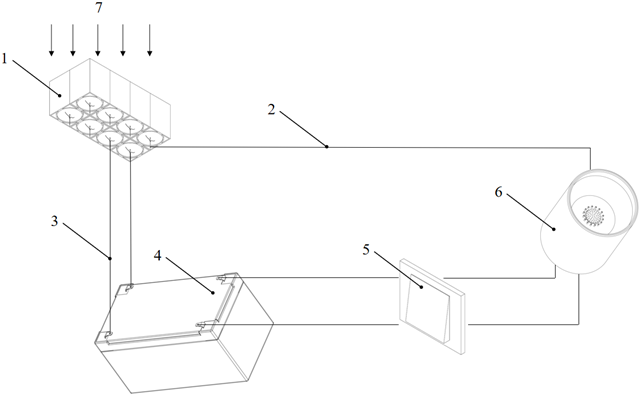
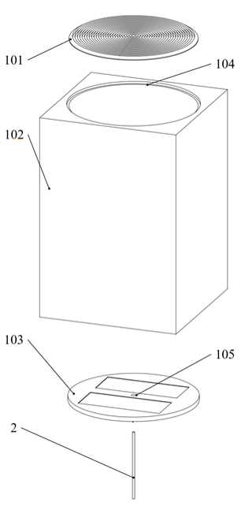
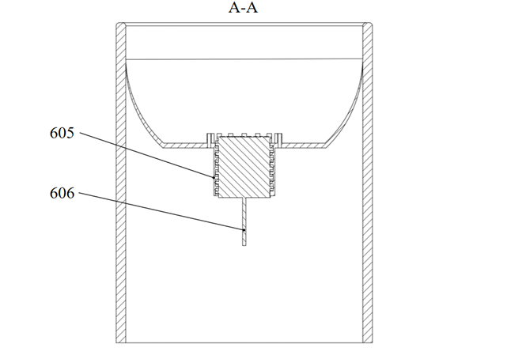
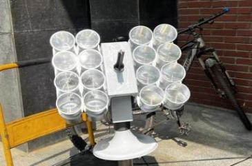
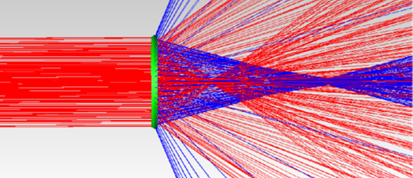
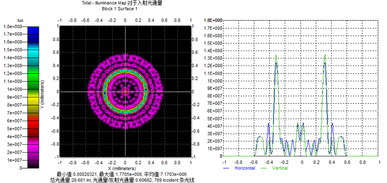
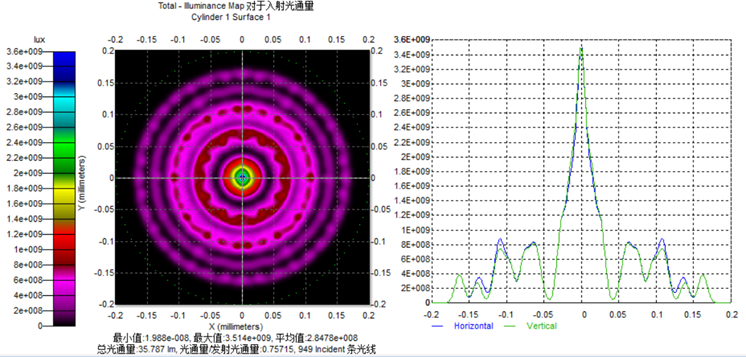
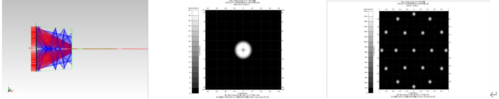

# Solar-Powered Optical Lighting and Energy Storage System

> **Fresnel Lens · Flexible Optical Fiber · Photovoltaics · Solar Tracking · TracePro Simulation**

An integrated solar lighting and energy-storage system that combines **direct daylight transmission** with **photovoltaic energy harvesting**.

The system uses Fresnel lenses to concentrate sunlight onto an integrated receiving region. Part of the collected light is coupled into flexible optical fibers for direct indoor illumination, while the remaining solar energy is captured by photovoltaic modules and stored for low-light or nighttime LED lighting.

The project combines **optical design, mechanical system design, solar tracking, photovoltaic integration, prototype development, and TracePro-based ray-tracing simulation**.

---

## Project Overview

Conventional solar lighting systems usually rely on either:

- direct daylight transmission, or
- photovoltaic conversion followed by electrical lighting.

Direct daylighting avoids unnecessary energy-conversion stages but depends on the availability of sunlight. Photovoltaic lighting can operate after sunset but introduces additional conversion and storage losses.

This project integrates both approaches into a single system.

<p align="center">
  
</p>

The system creates two parallel energy-utilization paths:

```text
                              ┌── Flexible Optical Fiber ──> Direct Indoor Lighting
Sunlight ──> Fresnel Lens ───┤
                              └── Photovoltaic Module ──> Energy Storage ──> LED Lighting
```

During daylight conditions, concentrated sunlight can be transmitted directly indoors through flexible optical fibers.

At the same time, part of the collected solar energy is converted into electrical energy and stored for later use.

When natural illumination is insufficient, the stored electrical energy can support LED lighting.

---

## Key Features

- Integrated solar daylighting and photovoltaic energy harvesting
- Fresnel-lens-based solar concentration
- Flexible optical-fiber light transmission
- Dual-mode indoor illumination
- Photovoltaic energy storage
- Solar tracking mechanism
- TracePro optical modeling and ray tracing
- Parametric optical-system optimization
- Physical prototype development
- Published utility model patent

---

# System Design

## 1. Solar Collection Module

The solar collection module is the core optical component of the system.

<p align="center">
  
</p>

The integrated collector contains:

- a **Fresnel lens** for solar concentration;
- a reflective collection housing;
- a photovoltaic receiving region;
- an optical-fiber coupling interface.

The Fresnel lens concentrates incoming sunlight toward a shared receiving region containing both the optical-fiber input and photovoltaic surface.

This configuration allows the same incoming solar radiation to support two functions:

**direct optical transmission** and **photovoltaic energy conversion**.

---

## 2. Optical Fiber Daylighting

Flexible optical fibers are used to guide concentrated sunlight from the outdoor collection module to the indoor illumination terminal.

Compared with rigid light-guide structures, flexible fibers offer greater freedom when routing light through complex building environments.

The optical path can therefore be arranged around structural obstacles while minimizing modifications to the building itself.

---

## 3. Dual-Mode Lighting Terminal

The indoor lighting terminal integrates natural-light transmission and electrically powered illumination into a single structure.

<p align="center">
  
</p>

Two illumination modes are supported:

### Daylight Mode

```text
Sunlight
   ↓
Fresnel Lens
   ↓
Optical Fiber
   ↓
Indoor Lighting Terminal
```

Natural sunlight is transmitted directly through the optical fiber for indoor illumination.

### Stored-Energy Mode

```text
Photovoltaic Module
   ↓
Energy Storage
   ↓
LED Module
   ↓
Indoor Lighting
```

When natural light is insufficient, stored electrical energy can be used to drive the integrated LED lighting module.

This arrangement allows the same lighting terminal to support both optical and electrical illumination.

---

# Solar Tracking

Efficient Fresnel-lens concentration requires the optical system to remain properly aligned with incoming sunlight.

The project therefore incorporates a solar-tracking architecture combining:

- solar-position estimation;
- photosensitive feedback;
- mechanical actuation;
- dual-axis orientation control.

The tracking system adjusts the orientation of the collection platform as the solar position changes throughout the day.

This design is also supported by the optical simulations, which show that solar collection performance is strongly affected by the incident direction of incoming light.

---

# Physical Prototype

A physical prototype was developed to validate the integrated system architecture.

<p align="center">
  
</p>

The prototype integrates the main functional components of the proposed system, including:

- Fresnel-lens collection;
- mechanical tracking;
- optical coupling;
- fiber-based light transmission;
- photovoltaic energy harvesting;
- indoor illumination.

The prototype was used together with optical simulations to evaluate the feasibility of the overall design.

---

# Optical Simulation

Optical modeling and ray-tracing analysis were performed using **TracePro**.

The simulations were used to study how the geometry and operating conditions of the concentrator affect the distribution of light reaching the optical-fiber and photovoltaic receiving regions.

---

## TracePro Model

A three-dimensional optical model of the solar collection unit was constructed in TracePro.

<p align="center">
  
</p>

The simulation model contains the main optical components of the physical system:

- Fresnel lens;
- reflective concentrator;
- photovoltaic receiving surface;
- optical-fiber receiving region;
- incident solar-light source.

---

## Ray-Tracing Analysis

Ray tracing was used to visualize how incoming light propagates through the Fresnel lens and concentrator.

<p align="center">
  
</p>

The analysis provides a visual representation of:

- refraction through the Fresnel lens;
- concentration of incident radiation;
- internal reflection inside the collection structure;
- distribution of light near the receiving surface.

---

# Parametric Optical Study

Three main optical parameters were investigated using controlled TracePro simulations.

---

## 1. Incident Angle

The first study investigated how the direction of incoming solar radiation affects the amount of light collected by the system.

<p align="center">
  
</p>

The results show that the optical system achieves its strongest collection performance when the incoming sunlight approaches **normal incidence** relative to the Fresnel-lens system.

As the incident direction deviates from the optimal orientation, the concentrated light distribution becomes less favorable and less energy reaches the receiving region.

This result provides the optical motivation for using an active solar-tracking mechanism.

---

## 2. Lens-to-Receiver Distance

The second study investigated the vertical distance between the Fresnel lens and the receiving surface.

<p align="center">
  
</p>

Changing this distance changes the location and spatial distribution of the concentrated light spot.

The simulation was therefore used to identify a suitable structural configuration in which the concentrated solar radiation can effectively illuminate the integrated optical-fiber and photovoltaic receiving region.

This parameter directly influenced the final geometry of the concentrator.

---

## 3. Fresnel Lens Focal Length

The third study examined the influence of Fresnel-lens focal length on the optical-energy distribution.

<p align="center">
  
</p>

Different focal configurations produce different light-concentration patterns inside the collection structure.

The simulation evaluates how focal-length selection influences:

- focal position;
- energy concentration;
- illumination distribution;
- optical coupling with the receiving region.

Together, these simulations provided guidance for optimizing the geometry of the solar collection module.

---

# Engineering Workflow

```text
System Concept
      │
      ▼
Mechanical & Optical Design
      │
      ▼
Fresnel-Lens Concentrator
      │
      ▼
Integrated Fiber / PV Receiver
      │
      ▼
Solar Tracking Design
      │
      ▼
TracePro Optical Modeling
      │
      ▼
Ray-Tracing Simulation
      │
      ▼
Parametric Analysis
      │
      ▼
Prototype Development
      │
      ▼
System Validation
```

---

# Published Patent

This project resulted in a **published utility model patent**:

### 一种兼具太阳能转换储能与照明的结构

**English:**  
*A Structure Integrating Solar Energy Conversion, Energy Storage, and Lighting*

The patented structure integrates:

- Fresnel-lens solar concentration;
- a reflective collection chamber;
- photovoltaic energy conversion;
- an optical-fiber coupling interface;
- battery energy storage;
- direct daylight transmission;
- LED illumination.

The central concept is an integrated **dual-use solar-energy architecture**, where concentrated sunlight can be used directly for optical-fiber daylighting while simultaneously supporting photovoltaic energy harvesting and storage.

---

# Project Scope

The project involved work across multiple engineering areas:

### Optical Engineering
- Fresnel-lens concentration
- Optical-fiber transmission
- Light coupling
- Optical ray tracing
- Optical parameter optimization

### Mechanical Engineering
- Collection-module structure
- Solar-tracking mechanism
- Lighting-terminal integration
- Prototype design

### Energy Systems
- Photovoltaic integration
- Energy storage
- Dual-mode lighting architecture

### Simulation
- TracePro modeling
- Ray-tracing visualization
- Controlled parameter studies
- Optical performance analysis

---

# Tools & Technologies

| Category | Tools / Technologies |
|---|---|
| Optical Simulation | TracePro |
| Data Analysis | Origin |
| Optical Components | Fresnel Lens, Flexible Optical Fiber |
| Energy System | Photovoltaic Module, Energy Storage |
| Control | Solar Tracking, Photosensitive Feedback |
| Mechanical Design | CAD / 3D Mechanical Modeling |
| Lighting | Natural Daylighting, LED Illumination |

---

# Repository Structure

```text
solar-optical-lighting-system/
│
├── README.md
│
└── figures/
    ├── system-overview.png
    ├── solar-collector.png
    ├── lighting-terminal.png
    ├── prototype.png.jpg
    ├── tracepro-model.png
    ├── ray-tracing.png
    ├── incident-angle.png
    ├── receiver-distance.png
    └── focal-length.png
```

---

# Authors

**Wang Weiran**  
**Ding Yingtong**  
**Zhao Jiuzhou**

Fan Gongxiu Honors College  
Beijing University of Technology

---

# Supervisors

**Kang Cunfeng**  
**Miao Yang**  
**Li Ran**

---

## Acknowledgement

This repository presents selected engineering design, prototype, and optical simulation results from the project.

The full project documentation is not included in this repository. The repository is intended to provide a concise technical overview of the system architecture, optical simulation workflow, prototype implementation, and associated patented design.
